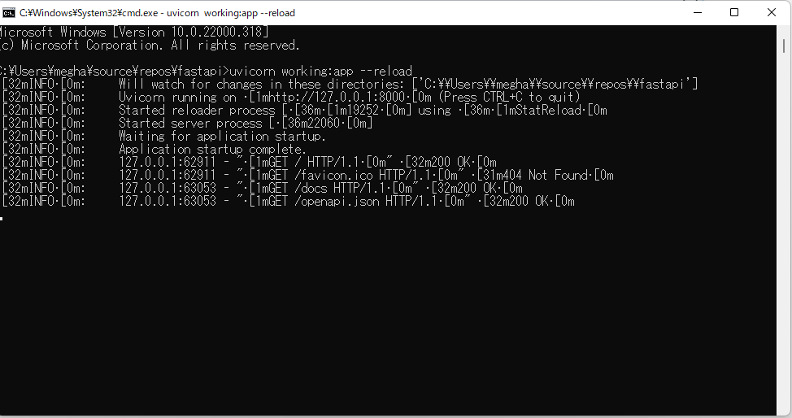

# fastapi

Dependencies:

pip install fastapi

pip install uvicorn

To Run:  
uvicorn working:app --reload  

working-name of the file  
app-variable in which fastapi is stored

Open the url showin cmd after running eg:(INFO:     Uvicorn running on http://127.0.0.1:8000 (Press CTRL+C to quit))  

open http://127.0.0.1:8000/ in the browser

http://127.0.0.1:8000/docs gives documentation of the api (automatically generated)

